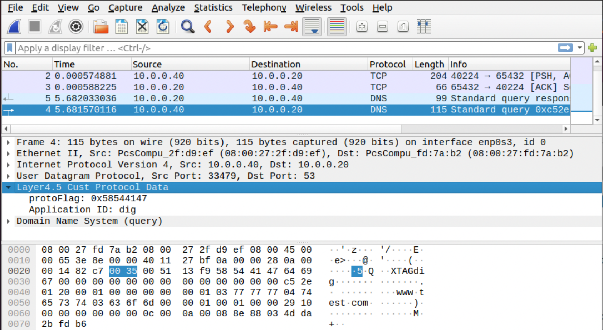
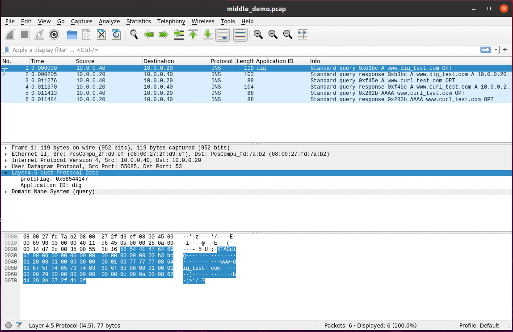

# Step for repeating experiments from paper submission

This README explains the steps to perform the experiments from the NetSoft '22
paper submission.  

NOTE: being updated to make easier to correlate with paper
  and repeat experiments

Note: Modules were built and installed on each VM, but the NCO could also be used
to build remotely and install via DCA connection

## Prerequisites:
1) To match the paper's experiments this requires 2 VM's running Layer 4.5 framework

    * These VM's need a method to communicate over the network.  Paper used an
    intnet setup.

    * download git repo to each VM (Client and Server)

1) (Client/DCA VM) Install sshpass and curl to allow remote server login and command execution

    * sudo apt install sshpass curl

1) (Client/DCA VM) Install matplotlib for plotting graphs:

    * pip install matplotlib

1) (Server/NCO VM) Install ssh server, sshpass, and enable root login:

    * sudo apt install openssh-server sshpass

    * open /etc/ssh/sshd\_config

    * add 'PermitRootLogin yes'

    * restart ssh: sudo systemctl restart ssh

1) (Both VM) set root password:

    * sudo passwd root

    * set to 'default'

1) (Client/DCA) ssh to Server VM to establish key:

    * sudo ssh root@10.0.0.20

    * ssh root@10.0.0.20

    * password = 'default'

1) (Server/NCO) ssh to Client VM to establish key:

    * sudo ssh root@10.0.0.40

    * ssh root@10.0.0.40

    * password = 'default'

1) (NCO) (Optional) install database browser:

    * I used DB Browser for SQLite (https://sqlitebrowser.org/dl/)

    * this is just a way to visualize database and manipulate entries

## NCO/DCA overhead experiment:

1) (NCO) launch experiment script:

    * update nco\_dca\_(batch)\_experiment files with your parameters

    * run: nco\_dca\_batch\_experiment 15

        * this performs 15 trials for each number of hosts and plots results

1) View generated graph: nco_deploy.png

## Bulk file transfer overhead experiment:

1) (Server) download Ubuntu image file

    * (alternatively) use any large file

    * store the file as 'overhead.iso' on the Desktop

1) (Client) Execute the bulk transfer script to perform all experiments and
generate the graph:

    * Update script parameters to match your device:

        * SERVER_DIR=directory with overhead.iso

        * GIT_DIR=directory holding the software_defined_customization git repo

        * SIMPLE_SERVER_DIR=$GIT_DIR/experiment_scripts/client_server

    * sudo experiment\_scripts/buk_experiment.sh 15

    * performs 15 trials

    * View generated graph: bulk_overhead.png

## Batch DNS overhead experiment:

1) (Server) Install dnsmasq on one of the Layer 4.5 capable VM

    * https://computingforgeeks.com/install-and-configure-dnsmasq-on-ubuntu/

    * DNSSEC not used during experiments

    * (Optional to match paper setup) Configure dnsmasq to:

        * resolve all IP addresses to same IP address

        * log queries

        * no cache

1) (Client) Execute the batch dns script to perform all experiments and
generate the graph:

    * Update script parameters to match your device:

        * GIT_DIR=directory holding the software_defined_customization git repo

    * sudo experiment\_scripts/batch_experiment.sh 15 1000 0

        * performs 15 trials of 1000 DNS requests with 0 sec between each request

    * View generated graph: batch_overhead.png

## Challenge/Response prototype:

1) (NCO) Update config file to match directory path for your machine:

    * git\_dir, symvers\_dir, etc.

1) Ensure Layer 4.5 module is loaded on NCO machine prior to starting

    * lsmod | grep layer

1) (NCO) Start NCO to begin listening for DCA connections

    * python3 software_defined_customization/NCO/NCO.py --challenge --window 5

1) (DCA) Start DCA and verify connected to NCO

    * sudo python3 software_defined_customization/DCA\_user/DCA.py

    * sudo required to install and remove modules

1) (NCO) make, deploy, and install the challenge/response module:

    * NOTE: unlike previous experiment modules, this is in the NCO/core\_modules dir because we are using the full NCO deployment instead of an experiment version

    * add 'nco\_challenge\_response' to CIB req\_build\_modules table for connected DCA device

    * 

1) (NCO) Verify nco\_challenge\_response is built and deployed to DCA and challenge/response window set to 5 seconds

    * 

1) (NCO) Allow NCO to run until 20 challenge/responses have completed

    * Verify each check passed via terminal output

    * 

1) (DCA) Verify each challenge/response was conducted correctly by reviewing
tracelog entries

    * 

## Middlebox demo:

1) NOTE: this demo will assume the middlebox is on same machine as the DNS server

1) (CLIENT/SERVER) Ensure Layer 4.5 running on each machine

1) (NCO) Start NCO to begin listening for DCA connections

    * python3 software_defined_customization/NCO/NCO.py

1) (CLIENT/SERVER) Start DCA on each machine and verify connected to NCO

    * sudo python3 software_defined_customization/DCA\_user/DCA.py

    * sudo required to install and remove modules

1) (SERVER) Start Middlebox DCA and verify connected to NCO

    * sudo python3 software_defined_customization/DCA\_user/DCA\_middlebox.py

    * sudo required to install and remove inverse modules

1) (SERVER) Ensure dnsmasq is running and listening for requests on the
10.0.0.20:53 address

1) Add module dependency to CIB inverse\_modules table:

    * module: demo\_dns\_server\_app\_tag

    * inverse: 'demo_dns_tag.lua'

    * type: Wireshark

1) (NCO) make, deploy, and install the server customization module:

    * add 'demo\_dns\_server\_app\_tag' to CIB req\_build\_modules table for server

1) (NCO) make, deploy, and install the client customization module:

    * add 'demo\_dns\_client\_app\_tag' to CIB req\_build\_modules table for client

1) (Server) Collect UDP packets:

    * using Wireshark on server

    * NOTE: Wireshark collection is below Layer 4.5, so packets are displayed
    from the network point of view

1) (Client) Perform several DNS queries

    * dig needs to be one of them

    * Others can be done with curl or web browser

1) (Server) Wireshark:

    * click on a DNS packet to see Layer 4.5 processing

        * reload lua plugins if not seeing app tags on DNS packets in next step

        * 

    * right click on Application ID field and add column to see in main view

        * 
